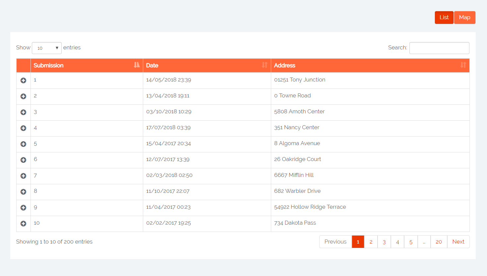

# frontend-dataviz
Goal: Display data using multiple json files 

Tech used:  
- jQuery  
- Bootstrap  
- Nested Datatables  

Assume you have questions and answers given by users to those questions in seperate json files.  
You want to view these submissions. (One submission can have a few answers - this depends on the number of questions)  
You also want to be able to sort the submissions by date and address.  

See the home page: 

When clicked on the plus sign - you get the details, i.e. the answers that the submission consists of.  
You can view these on a map by clicking on the "Map" button on top right. 
